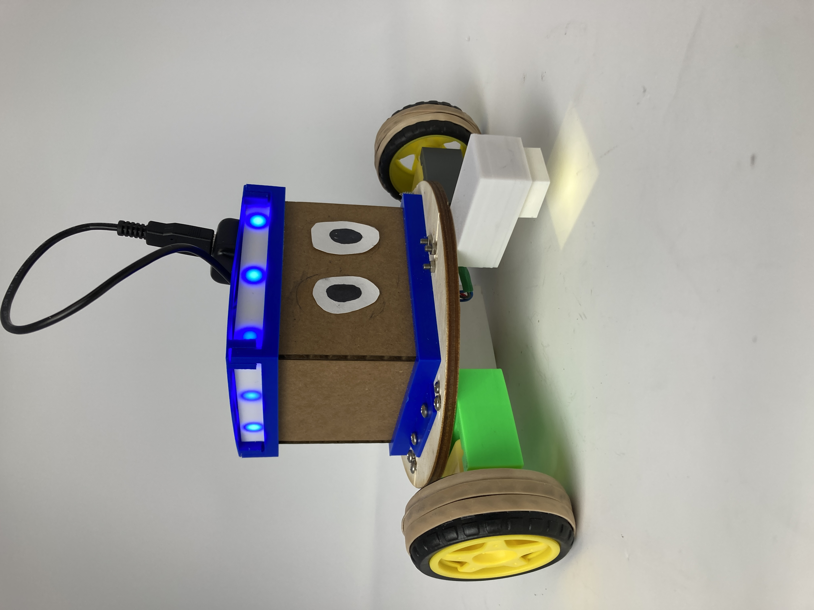

# blocky-coding

In this project, I created a physical programming language to help kids learn to code without looking at a screen!

For more details, check out the project page [here!](https://cjleggett.github.io/ps70/weeks/final.html)

